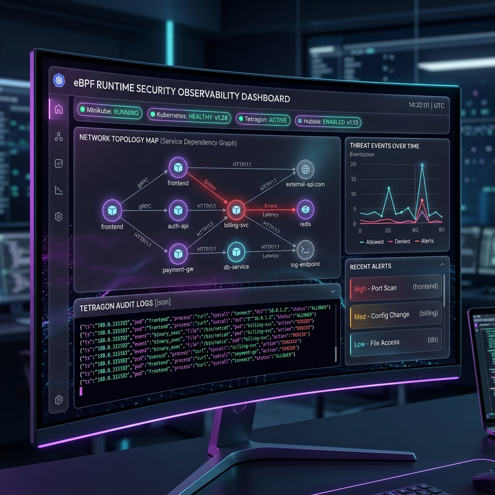

# 🛡️ eBPF-Powered Runtime Security & SRE Observability Platform

A real-time kernel-level runtime auditing and network-flow tracing pipeline utilizing **eBPF (Tetragon & Cilium Hubble)**, exposing SRE telemetry via a premium glassmorphic visual dashboard.



This repository implements a zero-agent-overhead security architecture designed to detect container escapes, block unauthorized host/system-level reads via kernel probes, and visualize namespaced network egress flows in production environments.

---

## 🏛️ System Architecture

The following diagram illustrates the kernel-to-frontend pipeline. Kernel-space kprobes and BPF socket filters capture actions and report events up to user-space agent DaemonSets. The SRE Dashboard queries these streams via a Python Flask API to render an interactive map.

```mermaid
flowchart TB
    subgraph Kernel Space (eBPF)
        TetragonKProbe[Tetragon Kernel Probes <br> security_file_permission / sys_setns]
        CiliumBPF[Cilium BPF Filters <br> Network Policy Engine]
    end

    subgraph User Space (Kubernetes Nodes)
        compromised-pod[compromised-pod]
        payment-gateway[payment-gateway]
        
        tetragon-agent[Tetragon DaemonSet]
        hubble-relay[Hubble Relay DaemonSet]
    end

    subgraph Observability Portal
        flask-backend[Flask REST API <br> app.py]
        sre-dashboard[SRE Glassmorphic Dashboard <br> app.js / Canvas Map]
    end

    %% Execution & Blocks
    compromised-pod -->|1. Attempt key read| TetragonKProbe
    TetragonKProbe -->|SIGKILL / Block| compromised-pod
    
    compromised-pod -->|2. Container escape| TetragonKProbe
    TetragonKProbe -->|Audit Log / Block| compromised-pod
    
    payment-gateway -->|3. Egress to Google| CiliumBPF
    CiliumBPF -->|Drop / Block| payment-gateway
    
    payment-gateway -->|4. Egress to Stripe| CiliumBPF
    CiliumBPF -->|Forward / Allow| api.stripe.com((api.stripe.com))

    %% Logs & Flows
    tetragon-agent -->|JSON Stdout Logs| flask-backend
    hubble-relay -->|gRPC Network Flows| flask-backend
    
    flask-backend -->|REST JSON Telemetry| sre-dashboard
```

---

## 🛠️ Technology Stack

| Component | Technology | Rationale & Capabilities |
| :--- | :--- | :--- |
| **Runtime Auditing** | [Tetragon](https://github.com/cilium/tetragon) (eBPF) | Intercepts system calls and kernel functions directly in the Linux kernel to block malicious activity with sub-millisecond latency. |
| **Network Tracing** | [Cilium Hubble](https://github.com/cilium/hubble) (eBPF) | Leverages eBPF socket filters to provide deep namespaced visibility into network flows (source, destination, port, DNS queries, and verdicts). |
| **Orchestration** | Kubernetes (Minikube) | Hosts the workloads and control plane, configured with standard CNI disabled to enable native Cilium eBPF integration. |
| **Dashboard Backend** | Python Flask | Queries live Kubernetes API logs, processes the Hubble telemetry stream, and serves UI endpoints. |
| **Visual Dashboard** | Vanilla HTML5 / Canvas / Chart.js | Renders an interactive glassmorphic layout with live connection flow particle animations and threat timeline trends. |

---

## 🖥️ SRE Observability Portal Features

The dashboard runs on `http://localhost:5000` (or falls back to simulated static telemetry if the cluster is offline).

1. **Cluster Health Monitor**: Real-time status indicators (Running/Stopped, Available/Unavailable) for Minikube, Kubernetes API, Tetragon Auditor, and Cilium Hubble.
2. **Interactive Hubble Service Map**: An HTML5 Canvas-based network topology mapping pods (`payment-gateway`, `compromised-pod`, `kube-dns`) and external endpoints.
   - **Interactive Node Dragging**: Drag nodes to rearrange the topology.
   - **Traffic Particles**: Cyan particles represent `FORWARDED` connections.
   - **Exploding Red Ripples**: Animated red wave ripples represent `DROPPED` packet attempts (e.g. egress violations).
3. **Tetragon Audit Console**: A simulated retro terminal streaming live JSON audit logs directly from Tetragon kernel events (processes executed, blocked syscalls, and namespace escapes).
4. **Threat Timeline Chart**: A line chart built using Chart.js displaying live total kernel events versus blocked security threats.

---

## 🚨 Security Policies & Scenarios Under the Hood

The platform deploys three custom eBPF security policies to protect the Kubernetes cluster:

### 1. In-Kernel Private Key Read Blocking
* **Policy File**: [block_private_key_read.yaml](file:///my%20devops%20projects/19-ebpf-runtime-security/tetragon/policies/block_private_key_read.yaml)
* **Mechanism**: Uses Tetragon's kernel hook on the `security_file_permission` LSM helper function (with `syscall: false`). If any process inside the `default` namespace attempts to access paths prefixed with `/etc/ssl/private/` or `/root/.ssh/`, the kernel fires a `SIGKILL` (exit code 137 or 1) to terminate the thread before the data reaches user space.
* **Simulation Command**:
  ```bash
  kubectl exec compromised-pod -- cat /etc/ssl/private/id_rsa
  ```

### 2. Namespace Escape Detection & Blocking
* **Policy File**: [detect_namespace_escape.yaml](file:///my%20devops%20projects/19-ebpf-runtime-security/tetragon/policies/detect_namespace_escape.yaml)
* **Mechanism**: Monitors kernel invocations of the `sys_setns` system call. Containers attempting namespace escapes (specifically trying to exit their container PID namespace into the host namespace via utilities like `nsenter`) are identified and immediately terminated with `SIGKILL`.
* **Simulation Command**:
  ```bash
  kubectl exec compromised-pod -- nsenter -t 1 -m -u -i -n -p sh -c "echo 'Escaped'"
  ```

### 3. FQDN-based Network Egress Control
* **Policy File**: [egress_rules.yaml](file:///my%20devops%20projects/19-ebpf-runtime-security/hubble-telemetry/egress_rules.yaml)
* **Mechanism**: Cilium network policy maps DNS labels at Layer 7. Permits pods labeled `app: payment-gateway` to perform DNS resolution (kube-dns UDP port 53) and communicate *only* with `api.stripe.com` and `stripe.com` (HTTPS port 443). All other egress connections are dropped by the eBPF filter.
* **Simulations**:
  - **Blocked Traffic**: Egress to unauthorized external domains (e.g. google.com) times out:
    ```bash
    kubectl exec payment-gateway -- curl -m 3 google.com
    ```
  - **Allowed Traffic**: Egress to authorized Stripe API succeeds:
    ```bash
    kubectl exec payment-gateway -- curl -m 5 -I https://stripe.com
    ```

---

## 🚀 Quick Start & Deployment Guides

### Prerequisites
- Linux host machine (required for eBPF kernel headers and Minikube docker driver)
- Docker Installed and running
- `kubectl` CLI
- Helm v3 CLI
- Python 3

### Mode A: Full Kubernetes + eBPF Cluster Deployment

This deploys a local cluster, configures the CNI, applies kernel-level tracing policies, runs the attack simulation suite, and launches the observability portal.

1. **Bootstrap the cluster**:
   ```bash
   ./deploy.sh
   ```
   *The bootstrap script automates the following actions:*
   - Creates a Minikube cluster with CNI disabled (`--cni=false`).
   - Deploys Cilium CNI and Hubble Relay.
   - Deploys Tetragon Kernel Audit engine via Helm.
   - Launches mock workloads (`payment-gateway` and `compromised-pod`).
   - Applies the eBPF TracingPolicies and Network Policies.
   - Simulates the attack scenarios to generate live audit logs.
   - Starts the SRE Observability Flask backend on port `5000`.

2. **Clean Up & Tear Down**:
   ```bash
   ./stop.sh
   ```

---

### Mode B: Local Development / Simulated Mode (No Cluster Required)

If you do not have a local Kubernetes cluster, Linux kernel headers, or want to run the portal instantaneously for UI/UX editing, you can run in **Simulated Mode**. The Flask backend detects the absence of Kubernetes and automatically reads pre-captured JSON audit trails:

1. **Create virtual environment & install dependencies**:
   ```bash
   python3 -m venv venv
   source venv/bin/activate
   pip install -r dashboard-app/requirements.txt
   ```

2. **Run the Observability backend**:
   ```bash
   python dashboard-app/app.py
   ```

3. **Access the portal**:
   Open [http://localhost:5000](http://localhost:5000) in your web browser. You will see the glassmorphic dashboard pre-populated with simulated live traffic, particle animations, and audit logs.

---

## 🩺 Troubleshooting

* **Minikube Failing to Start**: Ensure virtualisation is enabled in BIOS and you have sufficient memory (4GB+ allocated in `deploy.sh`).
* **Port 5000 Already in Use**: If port 5000 is occupied, you can change the port in [app.py](file:///my%20devops%20projects/19-ebpf-runtime-security/dashboard-app/app.py#L296):
  ```python
  app.run(host='0.0.0.0', port=5000, debug=True)
  ```
* **eBPF Logs Empty / Inactive**: Tetragon relies on matching your host kernel headers. If you receive compilation/loading issues, verify your kernel headers are installed (`sudo apt install linux-headers-$(uname -r)` on Ubuntu/Debian).
